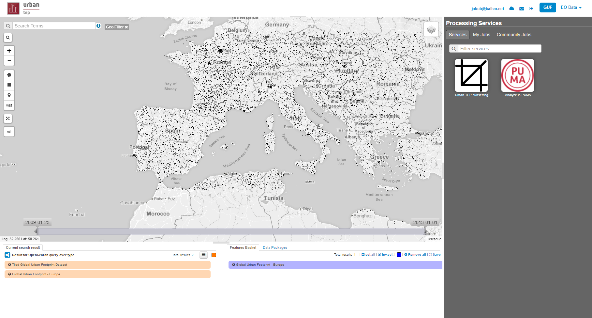
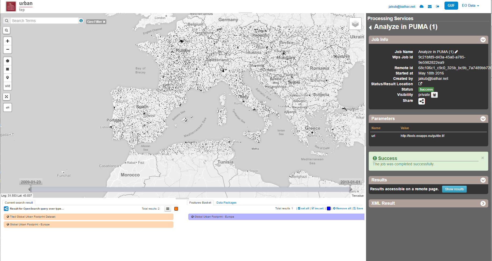
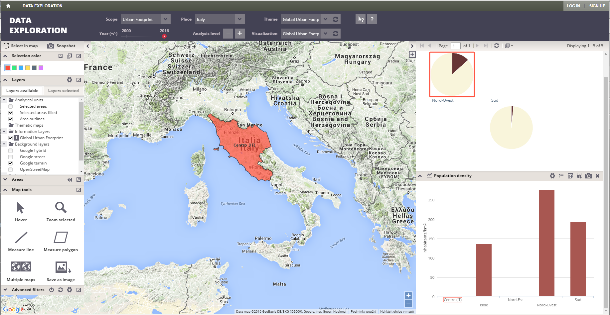
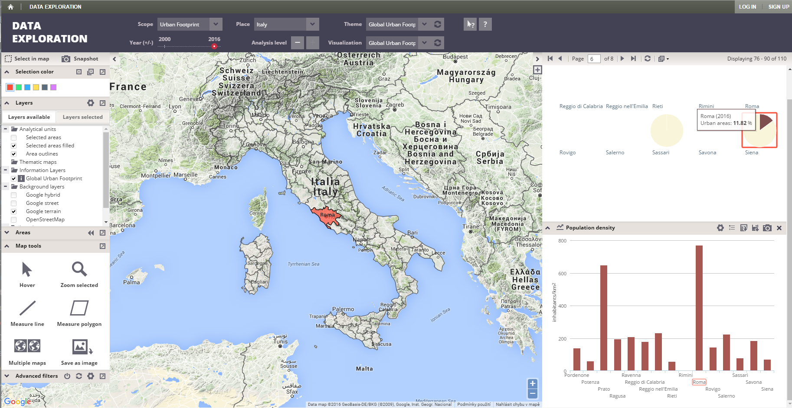

PUMA
====

PUMA UI - Basic user
--------------------

PUMA Exploration interface allows examination of various spatial data. Multiple map layers can be displayed, both static from local or remote sources and dynamically created choropleths from corresponding attributes. Aside from the map, attribute data can be also displayed in multiple graphs and/or tables, including optional normalization.

Top panel - dataset selection
"""""""""""""""""""""""""""""

Using the top panel, the user chooses which data they want to view. Data can be selected for a place, year and theme. Visualizations determine which map layers and graphs will be displayed.

Map
"""

On the map, PUMA can display various background layers (e.g. OpenStreetMap, Google Earth), raster and vector layers both uploaded into PUMA or from remote sources, and area layers - boundaries and selections.

Left panel - area and map layer selection
"""""""""""""""""""""""""""""""""""""""""

The left panel controls map layers and area selection. Under available layers, the user can select layers to display on the map. Under selected layers, they can configure the opacity and display additional information for each layer.
The examination can be narrowed down by selecting areas of interest, either in the area list or using the selection tools. Selected areas are highlighted both on the map and in all graphs.

Right panel - attributes visualizations
"""""""""""""""""""""""""""""""""""""""

The right panel contains all the configured tables or graphs. Any user can easily create their own, using any subset of available attributes. The attributes can be automatically normalized by area or other attributes.

Further documentation
"""""""""""""""""""""

It is possible to find further documentation on what is possible and how to use it is available at
https://puma.worldbank.org/help/ or http://urban-tep.gisat.cz/help/

PUMA UI - Expert user
---------------------

As an expert user it is possible to specify new visualization, which will be available to other users. It is also possible to specify other analysis, which will show the combination of the data received via TEP Urban processing and portal with other types of data already in PUMA. It also supports adding the data via other means than just TEP Urban processing centers.

Usage of PUMA UI from the portal in images
------------------------------------------

It is possible to import the data into the PUMA using the UrbanTEP portal. It is also then possible to see the data, which were jsut uploaded in the PUMA.

Steps necessary to use Guf subsetting with integration of PUMA.

1) After getting to the portal to allow you visualization of the Global Urban Footprint. 

2) Select the service to import the data into the PUMA
.. image:: analyse.png

3) Results of the analysis with the button, which will take you into the PUMA

4) Initial state of the Puma after taking you inside. The place will depend on which area you wanted to analyse.

5) PUMA after some playing in it

.. req:: TS-FUN-020
  :show:

  PUMA Thematic Application
  This section describes the PUMA thematic application.
   
