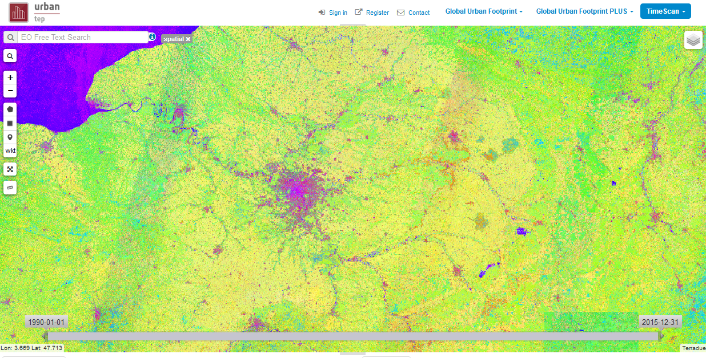
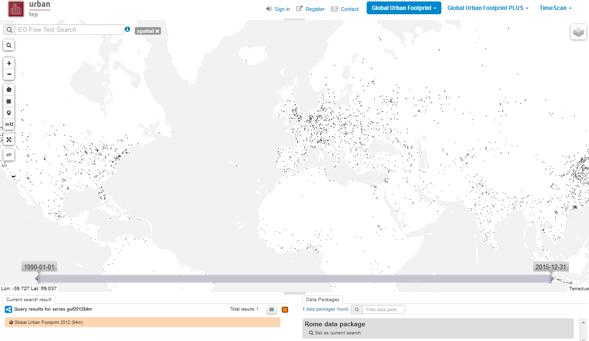
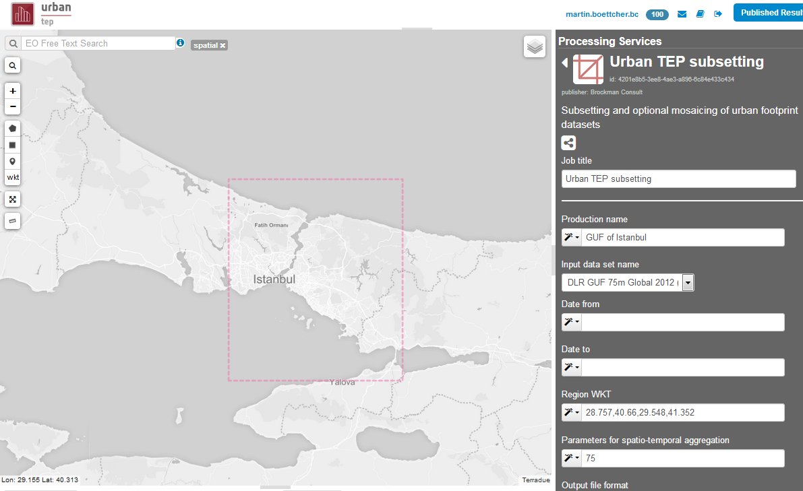

Thematic Apps
=============

Pre-defined apps
----------------

A *Thematic App* is a specific version of the geobrowser, in which specific parameters are pre-defined, in order to serve a specific thematic.
A list of pre-defined thematic apps can be accessed from the *Thematics* page.

.. figure:: ../includes/predefined_thematic_apps.png
	:figclass: img-border
	:scale: 60%

Among the pre-defined thematic applications are:

        - U-TEP product portfolio
	- Global Urban Footprint data subsetting
        - TimeScan on demand
        - Visualisation and Analytics Toolbox

U-TEP product portfolio
~~~~~~~~~~~~~~~~~~~~~~~

This application shows the different pre-processed Urban TEP products like Global Urban Footprint and TimeScan on the geo-browser. You can zoom into the data from global scale down to the native resolution of the products. Some of the products are available globally. Others are available for selected urban areas.

Use the drop-down boxes on the upper right menu to select the product. You may choos the background map from the layers symbol on the upper right of the map. In case of a time series like GUF evo you can hover over the product list on the lower right to move in time on the map.

Global Urban Footprint data subsetting
~~~~~~~~~~~~~~~~~~~~~~~~~~~~~~~~~~~~~~

The Global Urban Footprint data subsetting application allows subsetting of a GUF dataset and the subsequent combination of this GUF subset in an analysis, e.g. for statistics.

In the application choose Processing Service on the right. Then, select "Urban TEP subsetting". This will lead to the form to generate the desired subset in an Urban TEP processing centre. Parameters you can choose for this step are:

- A name for the production, e.g. the name of the urban area to be subsetted
- The input dataset, in particular the 75m and 12m GUF 2012, the GUF of selected cities between 1990 and 2015, and Buildup Density 2012, provided by DLR.
- The bounding box of the region. Use the map to draw the region, and transfer to the field with the helper left of the field. Do not select areas covering more than one urban area. Due to the high resolution else the files may get too big.
- Optionally parameters for aggregation: Default is no aggregation (delivery in tiles). You can specify the resolution of the mosaic (e.g. 75 for 75 meters) in the aggregation field (deleting the detailed XML parameter) to get one result file with the spatial mosaic in lat-lon projection. Or you can specify all parameters of the XML expression for resolution, spatial aggregation rule, temporal aggregation rule, band list, and filter criterion.

The parameters for Date from and to can be left empty for subsetting the GUF as you select the time with the input dataset. 
Note that in case of tiled input and no mosaicing you may get several tile subsets as result in case your region intersects tile boundaries.

Processing may take some minutes. The result can be used for an analysis in the visualisation toolbox. Go back one step (arrow on top left of the processing form) and select "Analyse in Visualisation Tool". 

TimeScan on demand
~~~~~~~~~~~~~~~~~~

The TimeScan on demand application processes timescan products for a selected region from Landsat data globally or from Sentinel 2 data (Africa) on request. While the geo-browser in the U-TEP Product Portfolio application shows just an image of the TimeScan product composed of 3 bands, various statistics and bands are included in the result product of this service. The service generates the product from the time series of the respective Level 1 input data.

.. figure:: ../includes/thematic_apps_timescan.png
	:figclass: img-border
	:scale: 60%

In the application either choose S2 processing or Landsat processing, then fill the parameters:

- A name for the production
- The input dataset
- The time period with date from and date to
- The region bounding box
- Optionally, you may select different index definitions instead of NDBI, NDVI and MNDWI for processing of S2

Processing may take some minutes to hours. The result can be downloaded for local analysis.

User's apps
-----------

A user is able to define its own *Thematic App* by selecting widget amongst:

- Dataset search widget defining series, collection or data packages OpenSearch endpoint
- processing Service widget defining service series OpenSearch endpoint
- Map description (background, layers)
- Data package widget defining the data packages OpenSearch endpoint
The application shall be defined using OGC OWS Context.

.. req:: TS-FUN-500
	:show:

	This section describes how a user can create its own thematic application.
