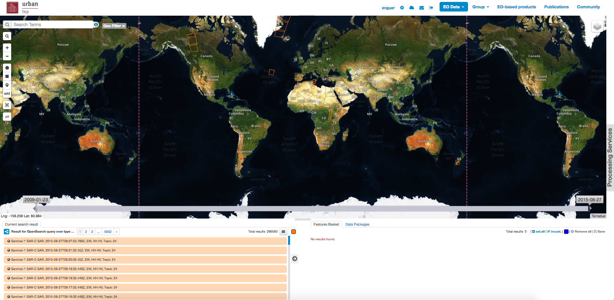

Thematic Apps
=============

Pre-defined apps
----------------

A *Thematic App* is a specific version of the geobrowser, in which specific parameters are pre-defined, in order to serve a specific thematic.
A list of pre-defined thematic apps can be accessed from the *Thematics* page.

.. figure:: ../includes/thematic_apps.png
	:figclass: img-border img-max-width
	:scale: 80%

The pre-defined thematics are:

	- Urban global thematic application
	- Global Urban Footprint

Urban global thematic application
~~~~~~~~~~~~~~~~~~~~~~~~~~~~~~~~~

This is the general Urban thematic application for demonstration purpose, containing all main functionalities of the geobrowser.

Global Urban Footprint
~~~~~~~~~~~~~~~~~~~~~~

.. figure:: ../includes/thematic_apps_guf.png
	:figclass: img-border img-max-width
	:scale: 80%

Global Urban Footprint application. It allows subsetting and analysis of the GUF dataset with PUMA.

User's apps
-----------

A user is able to define its own *Thematic App* by selecting widget amongst:

- Dataset search widget defining series, collection or data packages OpenSearch endpoint
- processing Service widget defining service series OpenSearch endpoint
- Map description (background, layers)
- Data package widget defining the data packages OpenSearch endpoint
The application shall be defined using OGC OWS Context.

.. req:: TS-FUN-500
	:show:

	This section describes how a user can create its own thematic application.
