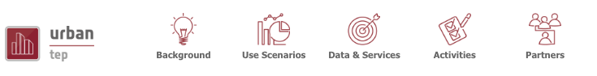

Menu bar
========

The menu bar is always visible, apart from the geobrowser page. It contains the following links:

- `Background`_,
- `Use Scenarios`_,
- `Data & Services`_,
- `Activities`_,
- `Community`_
- `Enter Platform`_

Home
----

A simple way to go back to the home page of the portal.

Background
----------

A page describing the Tep Urban concept and Tep Urban Era.

Use Scenarios
-------------

Some example of uses scenarios of the Tep Urban platform.

Data & Services
---------------

Page describing data and services that the platform provides.

Activities
----------

Passed and incoming activities around the Urban community.

Community
---------

Description of partners and actors of the Urban community.

Enter Platform
--------------

Enter the platform and access the geobrowser.