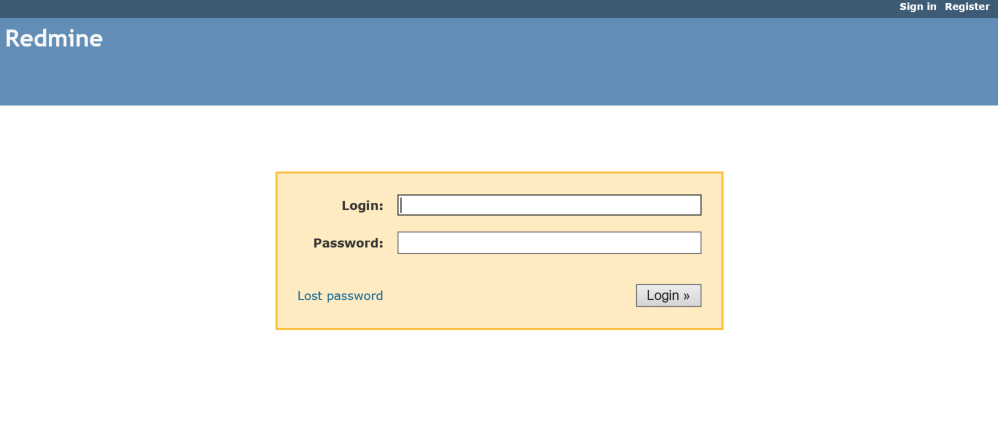
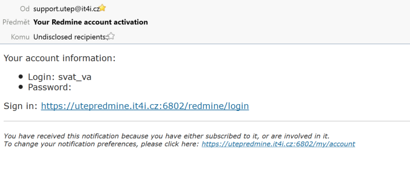
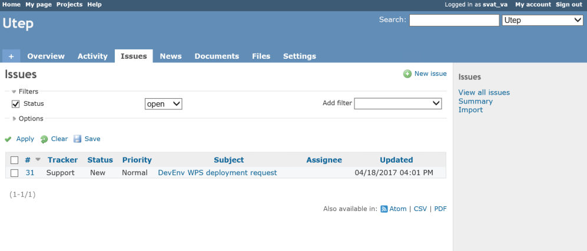

Support
=======

The support to users is done through a ticketing system, external to the platform.

Ticketing system is located at https://utepredmine.it4i.cz.

Obtaining login credentials
---------------------------

There are several ways to obtain login credentials:

- initiate specific action via U-TEP portal (Publish results request)
- send an email from the user's email address to support.utep@it4i.cz
- register via ticketing system login screen

If the user is not yet registered within the ticketing system, each method will create the new user account bound to the user's email address. The system will then automatically send the login credentials to a provided email address.

Issues
------
Each ticket in the Redmine system is represented by an Issue. Standard user is able to view and update his own issues. When the issue gets updated by a System or Support administrator, user is notified about the update via email.  

.. figure:: ../includes/redmine_detail.png
	:align: center
	:scale: 50%
	:figclass: img-container-border

.. req:: TS-ICD-140
	:show:

	This section describes how the user can access issues tracking from the geobrowser.
	
Issue escalation route
----------------------
See :doc:`Operational procedure for observation handing <../urbantep-oper/observationhandling>`.