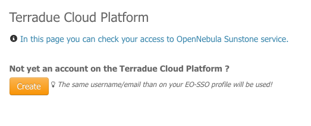
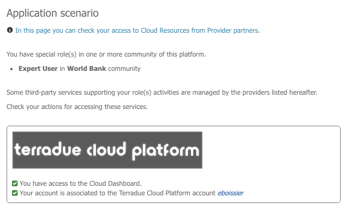
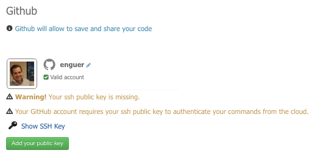

.. _user-profile:

User Profile
============

.. figure:: ../includes/user.png
	:align: center
	:width: 30%
	:figclass: img-container-border

Find out how to sign-in using **EO-SSO**, access your profile information, and even link it to your **Github** account.

Sign in
-------

Once registered on ESA EO Single Sign On (EOSSO), you can simply sign-in using the username and password provided by ESA and you will be automatically redirected to the platform homepage.
At the first access, you may be asked to check your inbox in order to confirm your address

.. figure:: ../includes/email_confirmation1.png
	:figclass: img-border
	:scale: 80%

If you never received the confirmation email, you can ask the system to send it again by clicking on the link **send again the confirmation email**:

.. figure:: ../includes/email_confirmation2.png
	:figclass: img-border
	:scale: 80%

After clicked the link received by email, you'll be able to see your profile page of the portal:

.. figure:: ../includes/email_confirmation3.png
	:figclass: img-border
	:scale: 80%

.. figure:: ../includes/user_signin.png
	:figclass: img-border
	:scale: 80%

By clicking on your username, you will access your profile page.
The other icons give the following functionalities:

- |user_signin_settings.png| Access to administration settings (for users with special privileges)
- |user_signin_cloud.png| Access to the cloud dahsboard (for users with special privileges)
- |user_signin_contactus.png| Link to contact the Urban Tep support team
- |user_signin_logout.png| Log out from the portal

.. |user_signin_settings.png| image:: ../includes/user_signin_settings.png
.. |user_signin_cloud.png| image:: ../includes/user_signin_cloud.png
.. |user_signin_contactus.png| image:: ../includes/user_signin_contactus.png
.. |user_signin_logout.png| image:: ../includes/user_signin_logout.png

Edit your profile
-----------------

.. figure:: ../includes/user_profile.png
	:figclass: img-border
	:scale: 80%
	
Fill in your profile:

1. Edit information such as first and last names, email, ... (username can not be modified though) by filling the input fields.
2. Once you are done, just click on **Submit** to save your changes.

.. NOTE::
		Direct access to your EO-SSO account is provided by clicking on *EO-SSO account*.

.. req:: TS-FUN-510
	:show:

	This section describes how a user can update profile information.

.. NOTE::
	If your UMSSO email is different from the one recorded in your profile, a message will appear in your profile (see image below).

.. figure:: ../includes/user_profile_email_change.png
	:figclass: img-border
	:scale: 80%

Change your password
--------------------

To change your EO-SSO password:

1. On your profile page, click on **EO-SSO account**.
2. On the EO-SSO account page, click on **Change user password**.
3. Write your old password, and your new password (twice).
4. Click on **Submit**.
5. Your password is updated.

Link your account to the Terradue Cloud Platform
------------------------------------------------

To access the Cloud resources, you need to have an account on the Terradue Cloud Platform. From this page, you can check that you have a valid account, or create a new one.

Don't have a Terradue account ?
~~~~~~~~~~~~~~~~~~~~~~~~~~~~~~~

If you don't have yet an account on the Terradue Cloud Platform

1. Click on the button "Create" 
2. Enter a password for the Terradue account (see below for password recommandations)
3. A new account will be created on https://www.terradue.com using your EO-SSO email/username

.. figure:: ../includes/t2_password_rules.png
	:figclass: img-border
	:scale: 80%

.. NOTE::
	If you want to create an account with a different username or email, you can do it directly at https://www.terradue.com/signup (but a least one of Username or email shall be the same as in EO-SSO).

Already have a Terradue account ?
~~~~~~~~~~~~~~~~~~~~~~~~~~~~~~~~~

If you already have an account on the Terradue Cloud Platform, the portal will be able to detect it by itself and display the Opennebula Sunstone logo. 
If not the case, it means that you have a different username/email than on your EO-SSO profile. In this case, please contact us so we can manually link your accounts.

Link your Github account
------------------------

Link your Github account to your profile will allow you to use Github as Software repository for the developments on your Sandboxes. You can also release and share your code there.

..note:: Link your github account is not mandatory but highly recommanded.

To link your Github account:

1. Fill in your github name and validate by clicking on |user_github_edit.png|.
2. You should add your ssh public key to your github account. Click on **Add your public key** and accept the request on your Github account.

.. NOTE::
	If you don't have a Terradue ssh key pair, you will need to create one from your Terradue Cloud Platform profile (https://www.terradue.com/portal/settings/key).

.. req:: TS-FUN-510
	:show:

	This section describes how a user can update github information.

.. |user_github_edit.png| image:: ../includes/user_github_edit.png

See your groups
---------------

To find out to which groups you belong, just go to the **Groups** tab on your profile page.
The groups in which you are a member are listed here.

See your usage
--------------

To find out how you are using the platform, just go to the **Usage** tab on your profile page.
You will see what is your level for each type of usage of the platform.

The table **Analytics** will display more precisely the number of data packages you loaded, the number of jobs you created, how many failed or were successful, ...
It describes:

- how many data collection you loaded
- how many data packages and items you loaded
- how many wps jobs you created and how many failed or succeeded

.. req:: TS-ICD-060
    :show:

    This section shows that the platform has an analytics web widget.

See your accountings
--------------------

The accounting panel on your profile gives your current credit balance, as well as the list of all transactions associated to your account:

- credit transactions
- debit transactions reported by wps providers for the wps jobs you created
- deposit transactions (see section below)

.. _deposit:
Deposit
~~~~~~~

A deposit transaction is performed when the user execute a job process using as balance the quotation returned first by the processing service for the selected parameters (it implies that the wps provider implemented the **quotation mode**). Deposit transactions can be *active* or *resolved*. An **active deposit** is accounted when calculating your account balance (covering the possible debit transactions associated to the same process). A **resolved deposit** is not accounted when calculating your account balance (but does not cover anymore the possible debit transactions associated to the same process). A deposit is automatically set from *active* to *resolved* when the job process status is not *In progress* anymore.

Transaction policy
~~~~~~~~~~~~~~~~~~

The current policy for a wps job process accounting is that the total amount debited to the user corresponds to the real usage of the wps process and cannot be greather than the estimated deposit.
