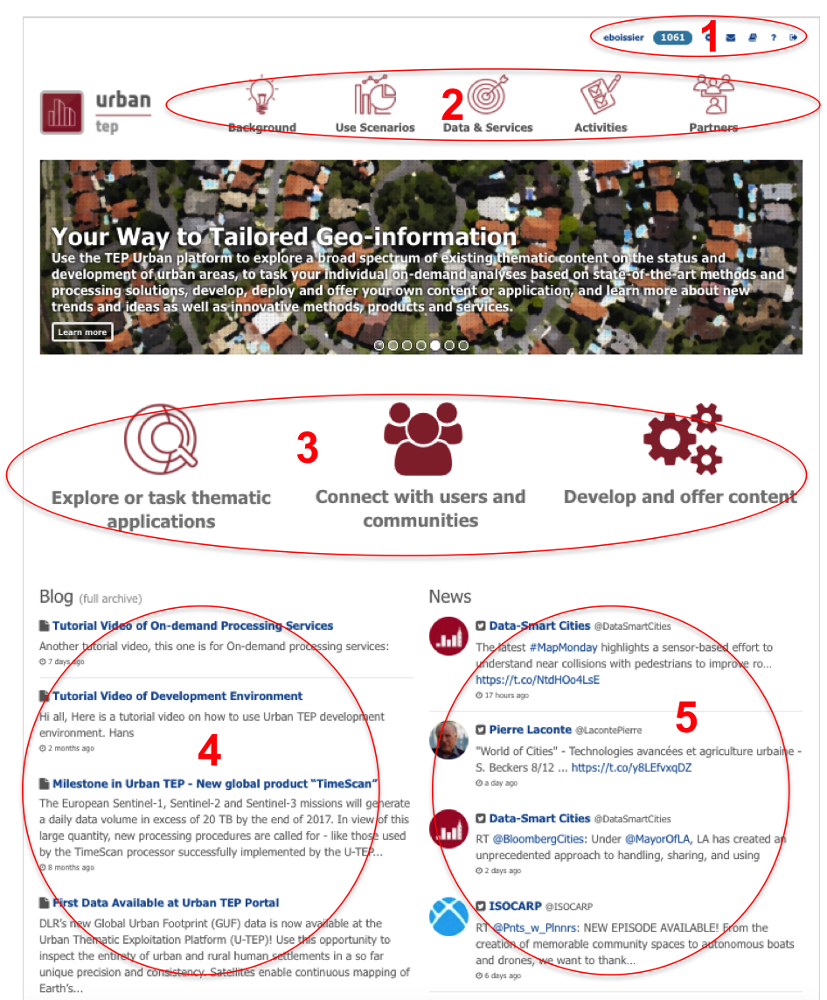
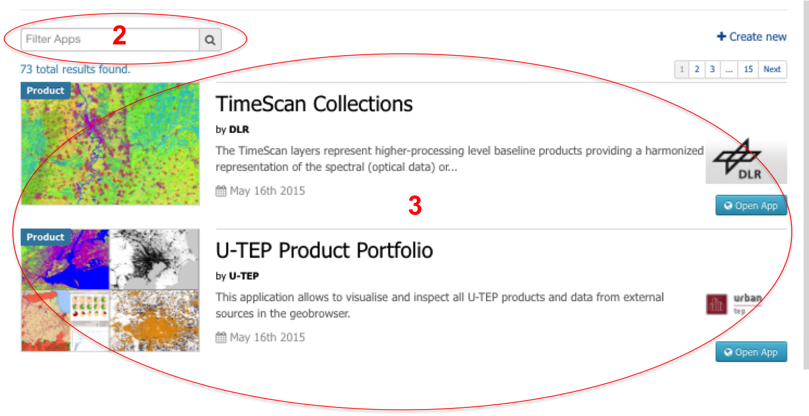

.. _QSM2:

Browse your way through the U-TEP Portal
----------------------------------------

Once you are registered in ESA’s Earth Observation Single Sign on environment (ESA EO-SSO-ID) and logged onto the Urban Thematic Exploitation Platform (U-TEP) Community Portal (See :doc:`Quick Start Manual 1 <qsm1>`), you are in the U-TEP Community Portal. This document guides you the way through.

.. NOTE:: 
	Some of the functions and features below are not visible if you are not registered and logged onto U-TEP. Also, some features and functions might be invisible because your user status is not advanced enough yet.

The U-TEP Community Portal Homepage
===================================

Figure 1 shows the homepage of the U-TEP Community Portal, which can be accessed through the following link: https://urban-tep.eo.esa.int/#!.

1. This part of U-TEP is where a user can register in ESA’s EO SSO environment, sign into the U-TEP Community Portal and contact U-TEP.

2. The menu of U-TEP, from where you can get yourself to the following pages:

	- **Background:** Summarises the purpose of U-TEP, including a short introductory video.
	- **Use Scenarios:** Some example of uses scenarios of the Tep Urban platform.
	- **Quick Start:** Provides a list of Quick Start Manuals for users to immediately start understanding and working with U-TEP.
	- **Data & Services:** A page describing data and services that the platform provides.
	- **Activities:** List of passed and incoming activities around the Urban community.
	- **Partners:** An overview of the consortium who developed U-TEP.
 

	Figure 1: Overview of U-TEP Community Portal homepage

3. The main pillars of the U-TEP Community Portal: 

	- **Explore or task thematic applications:** An overview of and the ability to discover available thematic applications (representing a product or a service) on the U-TEP platform.
	- **Connect with users and communities:** An overview of existing and available communities, for instance communities in specific geographic areas and/or specific organisations. 
	- **Develop and offer content:** Discover how to develop and offer content in the U-TEP platform.

4. A list of recent blogs containing information about (upcoming) U-TEP activities.

5. A list of recent (twitter) news from U-TEP involved organisations, companies and/or Urban projects.

Discover Thematic Applications
~~~~~~~~~~~~~~~~~~~~~~~~~~~~~~

1. An overview of existing thematic products and services as shown in Figure 2 is accessed by clicking on View Apps below the Discover Thematic Application section indicated at step 3 of section 2.2.1. A thematic application can represent a thematic product - indicated by corresponding blue label in the related icon for the application - or an (on-demand) service indicated by a red label in the related icon.
 

	Figure 2: List of existing Thematic Applications

2. Currently only a limited number of thematic applications (products, services) is available. Once the number of thematic application has increased, this search field can be used to easily find your application of interest.

3. An overview of existing thematic applications, including information about each application. Select your application of interest (e.g. TimeScan Collections) and click on Open App to access your application of interest. A new window will appear, called the Geobrowser.

Join Communities
~~~~~~~~~~~~~~~~

1. Go back to the U-TEP Community Portal of Figure 1. You access an overview of existing and available communities as shown in Figure 3, by clicking on View Communities in the U-TEP Community Portal of Figure 1. A community is a group of U-TEP users sharing the same interest: for example the same geographic area, the same thematic application or the same institution/organisation. Each community has a short description of itself, so you will know what community might be of interest for you.

.. figure:: includes/qsm2-f3.png
	:align: center
	:width: 80%
	:figclass: img-container-border	

	Figure 3: List of existing U-TEP Communities

2. You can become member of a community by clicking on Join. Once you have joined a community you can access your community by clicking on Enter. More info about the features within a community follows in :doc:`Quick Start Manual 3 <qsm3>`. 

3. The search field can be used to find your community of interest. 

Develop and offer content
~~~~~~~~~~~~~~~~~~~~~~~~~

1. Return to the homepage of Figure 1 again. Clicking on View Develop and offer content guides you to a webpage containing the steps to follow for the following actions:

	a. Registration as well-known user
	b. Requesting upload of a user-provided urban dataset
	c. Requesting publication of a dataset
	d. Downloading U–TEP’s VM for processor development and deployment
	e. Development, test, packaging, and upload of a data processor
	f. Publication of a data processor for use by other users
	g. Requesting publication of a result dataset
	h. Proposal of a data processor for systematic processing
