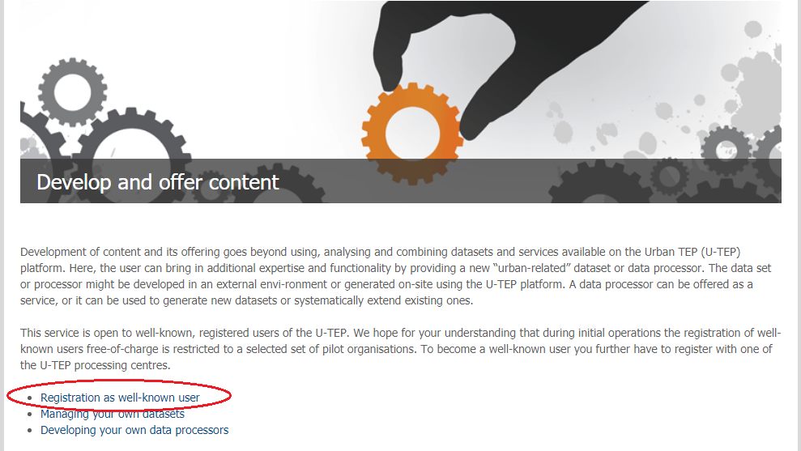
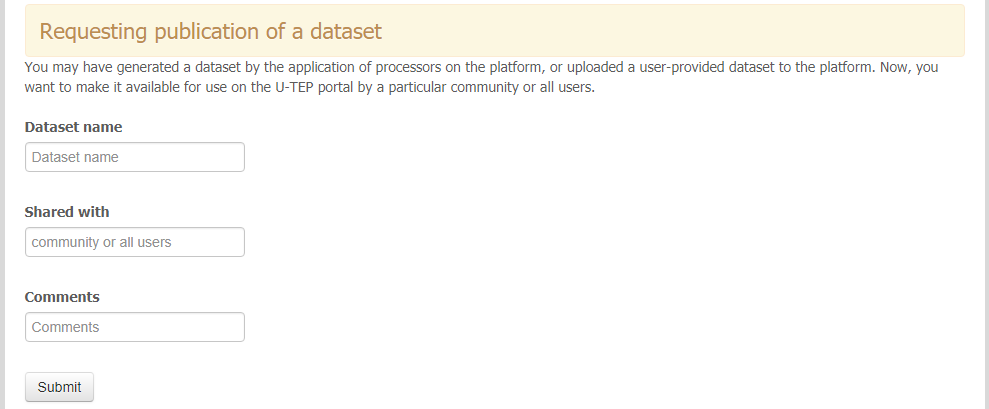

.. _QSM5:

Upload Your Own Data and Tools
------------------------------

These options are available only to the registered users after sign-on using your EO-SSO ID. This service is open to well-known, registered users of the U-TEP portal and to become one, you have to register with one of the U-TEP processing centres. The registration form is located on the "Develop and offer content" page.

.. figure:: includes/qsm5-f1.png
	:align: center
	:width: 80%
	:figclass: img-container-border

	
The submission of the registration form generates the ticket within the platform's ticketing system. The helpdesk operator is automatically informed about the new ticket and the following use case specific communitation is performed via this ticketing system.
	
Upload your data
================

You have the following options regarding your own dataset which you want to use on the platform:

* request upload of your dataset on the platform and make it available for all users or selected community as a new product
* request upload of your dataset on the platform and make it available for all users or selected community as a new dataset for processing (using existing processors or custom processors)
* request upload of your dataset on the platform and make it available just for your processing (using existing processors or custom processors)
* request publication of the dataset you have generated on the platform as a new product for all users or selected community 

When you log into the platform you can find the appropriate request forms on the "Develop and offer content" page. To view the request forms use "Managing your own datasets" link.

	
..NOTE:: 
	There are only two request forms regarding the uploading or publishing of a dataset. The specified use case should be described within the form or later on through the created ticket in the helpdesk system.

Request upload of a dataset
~~~~~~~~~~~~~~~~~~~~~~~~~~~

Fill the "Requesting upload of a user-provided dataset" form to upload your dataset for the publication as a product or as a dataset for processing.

.. figure:: includes/qsm5-f3.png
	:align: center
	:width: 80%
	:figclass: img-container-border

You will be contacted by a selected processing center operator via the helpdesk system about the method of the dataset upload. The processing center operator ingests the data e.g. by harvesting it from a remote location, or by offering you an FTP drop-down point for the processing center. In the end, the help desk operator informs you about the finalisation of your request.
	
Request publication of a dataset
~~~~~~~~~~~~~~~~~~~~~~~~~~~~~~~~

Fill the "Requesting publication of a dataset" form to publish the dataset you have generated on the platform as a new product.

	
This form creates a new ticket within the helpdesk system of the platform. When the necesarry configuration is done, the help desk operator informs you via this ticket about the finalisation of your request.

Upload your tool
================

To upload your own tool you have to use the development environment package available on the "Develop and offer content" page.

... in preparation
