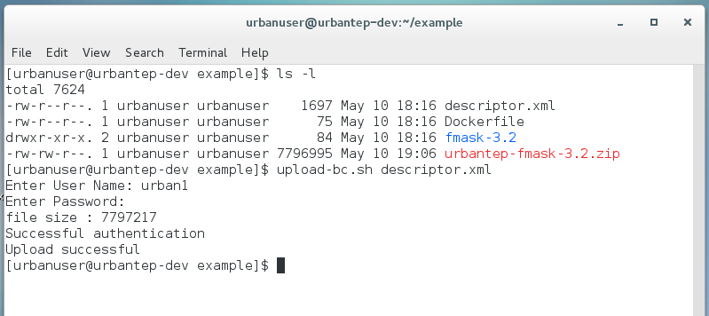

Packaging and upload
--------------------

After the successful local test the processor can be packaged and uploaded to a processing centre for deployment and later application to larger datasets. The same way an updated processor can be installed to supersede a previously installed processor version (with explicit versioning, you are responsible for version numbers yourself).

The packaging and upload are two steps provided in the readme of the previous subsection already. The follwing figures show the packaging for a particular processing centre, the content of the package, the upload, and the verification of deployment in the processing centre.

The package is created with the package-bc.sh tool. It generates a zip file for later upload.

.. figure:: urbantep-dev-test-package.png
   :scale: 65
   :align: center

   Creation of the processor package for upload to the BC processing centre

The zip file for the BC processing centre is filled according to your descriptor.xml file. It contains the processor software as .tar.gz and additional information specific to the processing centre already. 

This package is uploaded with the upload-bc.sh tool. This requires user name and password of a well-known user of the respective processing centre.

   Uploading the processor package to the BC processing centre

Finally, depending on the processing centre and the user's status, it can be verified at the processing centre's WPS gateway whether the processor has been deployed. The verification uses the describeProcess-bc.sh tool and requires the same user and password as the upload-bc.sh tool.

.. figure:: urbantep-dev-test-describe.png
   :scale: 65
   :align: center

   Verification of processor deployment at the BC processing centre

   
Packaging and upload - IT4I processing center
^^^^^^^^^^^^^^^^^^^^^^^^^^^^^^^^^^^^^^^^^^^^^

The overall process of packaging and uploading of the processor is exactly the same as described by Brockmann Consult processing center, apart from the last step - verification script. While the Brockmann is using fully automatic deployment process, the IT4I's deployment process requires manual preparation of the WPS service as the last step.

**Packaging**
The package is created with the package-it4i.sh tool. It generates a zip file for later upload to IT4I processing center.

**Uploading**
This package is uploaded with the upload-it4i.sh tool. This requires user name and password of a well-known user of the IT4I processing centre.
Succesful upload automatically creates a new ticket in the U-TEP ticketing system with a request to set up new processor in the form of WPS service.

.. figure:: ../includes/redmine_detail.png
	:align: center
	:scale: 50%
	:figclass: img-container-border
	
**Processor update**
Simple processor content update is performed automatically via upload-it4i.sh tool. If the user wants to make some changes in the scripts that are part of the processor package but these changes does not require the deployment of the new processor (processor is using the same dataset, contains the same parameters, etc.), user can simply package the same processor with an updated content and upload it under the same name and version. Upload script will automatically detect the existing processor and update its content. Note that uploading the same processor with the different version number is considered as a deployment of a new processor that requires manual setup on the IT4I's side.