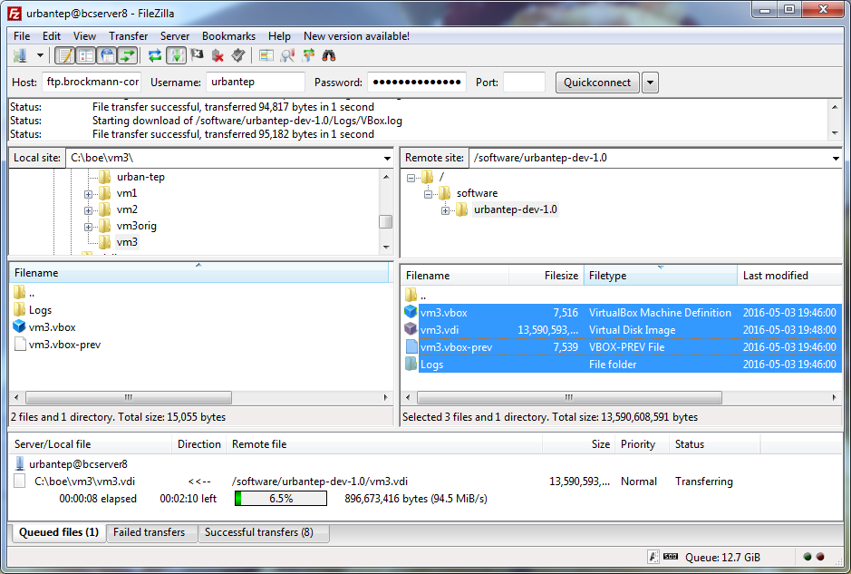
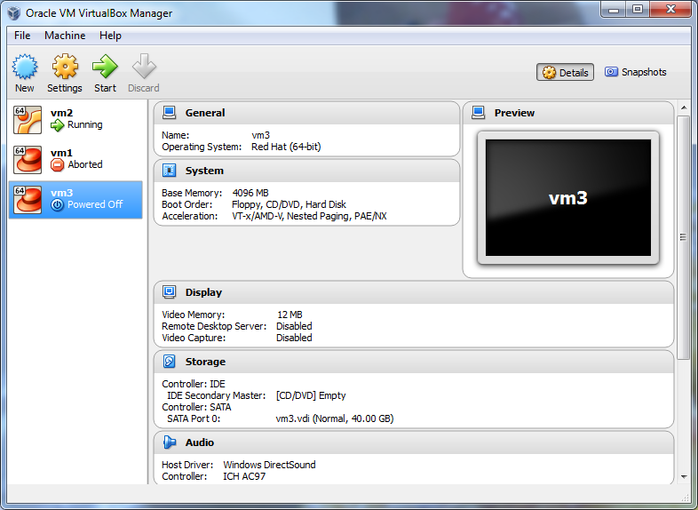
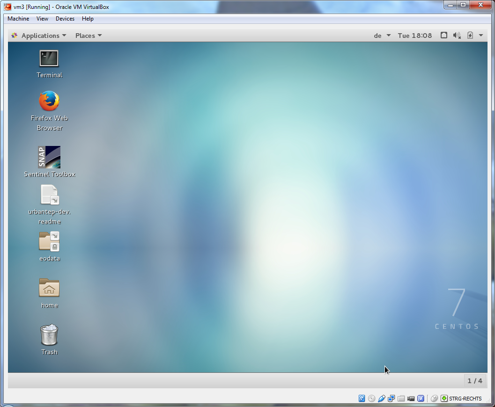

Obtaining and starting the VM
-----------------------------

The Urban TEP processor development environment is available as a virtual machine disk image in .vdi format from

- host ftp.brockmann-consult.de
- user urbantep
- dir software/urbantep-dev-1.0/

for internal users. It will be made available to well-known external users via the portal after validation. Well-known external users are users that run through a particular registration process with the processing centre(s) they will use.

   Downloading the Virtual Machine image from the BC FTP server

Copy the content of the virtual machine image directory to a local directory on your machine. Unless done, install Oracle Virtual Box on your machine. Later on also hosting a VM in a processing centre will be available.

Start Virtual Box, configure the VM with 4 GB RAM, 2 cores, bridged network. Start the virtual machine.

   Starting the VM in Virtual Box

Login to the VM

.. figure:: urbantep-dev-vm-login.png
   :scale: 50
   :align: center

   Login into the Urban-TEP development VM

as 

- user urbanuser
- initial password urbanuser

You may change the password after first login with the passwd command in a terminal window.

   Desktop environment of the Urban-TEP development VM

The desktop of the Urban-TEP VM shows some icons of pre-installed applications

- Terminal, used for local processor tests, packaging, upload
- Web browser
- Sentinel Toolbox SNAP
- README with tutorial instructions for an example processor

Additional standard software can be searched for and installed with

- sudo yum search <name>
- sudo yum install <name>
